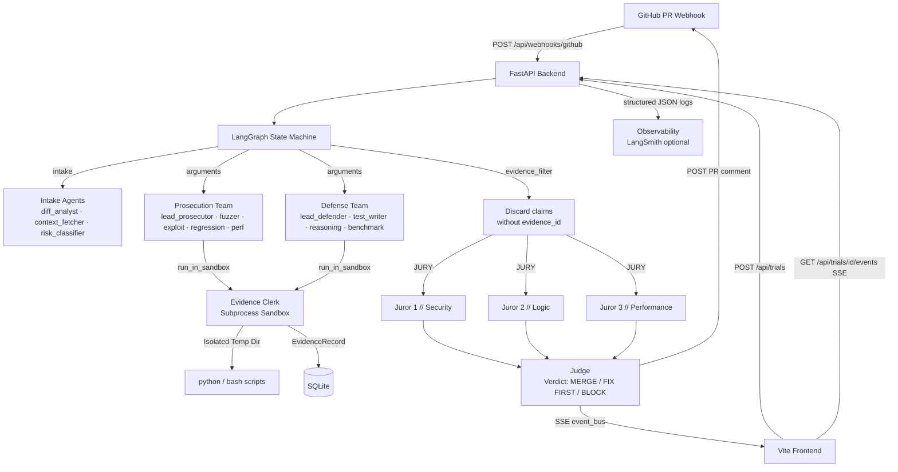

# PR Court

> Every pull request deserves a fair trial.

PR Court puts every GitHub pull request on trial. A prosecution team of AI agents tries to break the PR. A defense team tries to prove it safe. Every claim must be backed by real evidence from a sandbox run. A jury of 3 independent agents and a judge give a verdict (**MERGE / FIX FIRST / BLOCK**) based only on evidence.

---

## Architecture



---

## Quickstart (Lightweight, No Docker required)

### 1. Clone and configure

```bash
git clone https://github.com/yourorg/pr-court
cd pr-court
cp .env.example .env
# Edit .env – at minimum set MOCK_MODE=true for demo
```

### 2. Install dependencies

```bash
# Frontend
npm install

# Backend
cd backend
pip install -e ".[dev]"
alembic upgrade head
cd ..
```

### 3. Run the app

```bash
python start.py
```

- Frontend: http://localhost:5173 (or 3000 depending on Vite config)
- Backend API: http://localhost:8000/api/docs
- Database: Local SQLite file (`prcourt.db`)

### 4. Click "Put a PR on Trial"

With `MOCK_MODE=true`, clicking the CTA replays a canned FIX_FIRST trial (a login case-insensitivity rate-limit bypass) live in the courtroom UI with realistic delays and zero API calls.

---

## Environment Variables

| Variable | Default | Description |
|----------|---------|-------------|
| `MOCK_MODE` | `true` | Replay canned trial; no LLM calls |
| `VITE_USE_MOCK` | `false` | Frontend uses local mock events (no backend) |
| `VITE_API_URL` | `http://localhost:8000` | Backend URL for the frontend |
| `DATABASE_URL` | `sqlite+aiosqlite:///./prcourt.db` | Async database URL |
| `GOOGLE_API_KEY` | — | Google Gemini API key |
| `OPENAI_API_KEY` | — | OpenAI API key |
| `ANTHROPIC_API_KEY` | — | Anthropic Claude API key |
| `GITHUB_APP_ID` | — | GitHub App ID for webhook |
| `GITHUB_WEBHOOK_SECRET` | — | HMAC secret for webhook verification |
| `TRIAL_BUDGET_USD` | `2.0` | Abort trial if cost exceeds this |
| `LANGSMITH_TRACING` | `false` | Enable LangSmith tracing |

### Per-agent model overrides

```bash
PRCOURT_MODEL_INTAKE=gemini-1.5-flash
PRCOURT_MODEL_JUDGE=gemini-1.5-pro
PRCOURT_MODEL_JUROR_2=claude-3-5-sonnet-20241022
PRCOURT_MODEL_JUROR_3=gpt-4o
```

---

## The Core Rule

> A claim only counts if it links to an `Evidence` record produced by the sandbox.

The `evidence_filter` node **discards every claim with no `evidence_id`** before the jury sees anything. Jurors receive only:
1. The diff summary
2. Surviving admitted claims
3. Linked evidence records (command, exit_code, stdout)

They never see raw agent chat.

---

## Sandbox Security (Subprocess-based)

- Each command runs in an isolated temp directory that is wiped after.
- Wall-clock timeout via asyncio.
- On POSIX systems: CPU time limit, virtual memory limit, and max processes (anti-fork-bomb) via `resource`.
- On timeout, the entire process group is killed to clean up child processes.
- No secrets are passed in environment variables.
- *Note: For completely untrusted code, wrap this in a Firecracker microVM or restricted container.*

---

## Adding a New Agent

1. **Add a model mapping** in `/backend/app/config.py` (`AgentModels`):
   ```python
   my_agent: str = "gemini-1.5-flash"
   ```

2. **Add an override env var** (auto-discovered by pydantic-settings):
   ```bash
   PRCOURT_MODEL_MY_AGENT=gpt-4o
   ```

3. **Implement the agent logic** in `/backend/app/trial_runner.py`:
   ```python
   async def _run_my_agent(state: TrialState, sandbox: SandboxRunner) -> list[dict]:
       # Run commands via sandbox ONLY
       ev = await sandbox.run_command("my_test_command", "my_agent")
       ev_id = await _persist_evidence(state["trial_id"], ev, "my_agent")
       # Publish events
       await _pub(state["trial_id"], EventType.EVIDENCE_RECORDED, {...})
       # Return claims (only if evidence_id is set)
       if ev.exit_code != 0:
           return [{"side": "prosecution", "evidence_id": str(ev_id), ...}]
       return []
   ```

4. **Wire into the appropriate phase** (`_run_prosecution` or `_run_defense`)

5. **Add a frontend agent card** (auto-rendered via SSE `agent_status` events)
